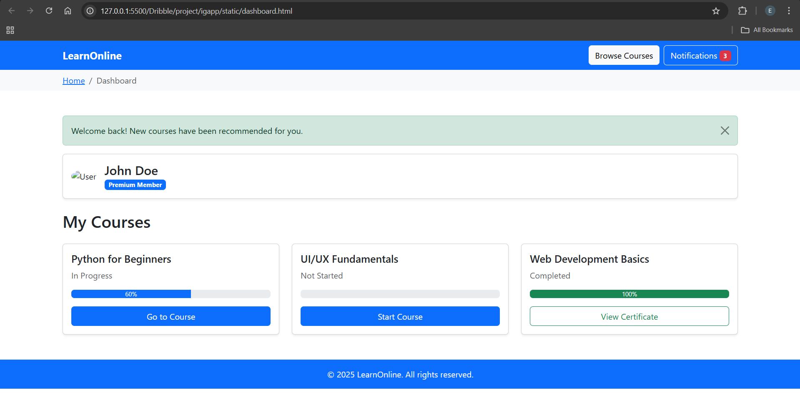
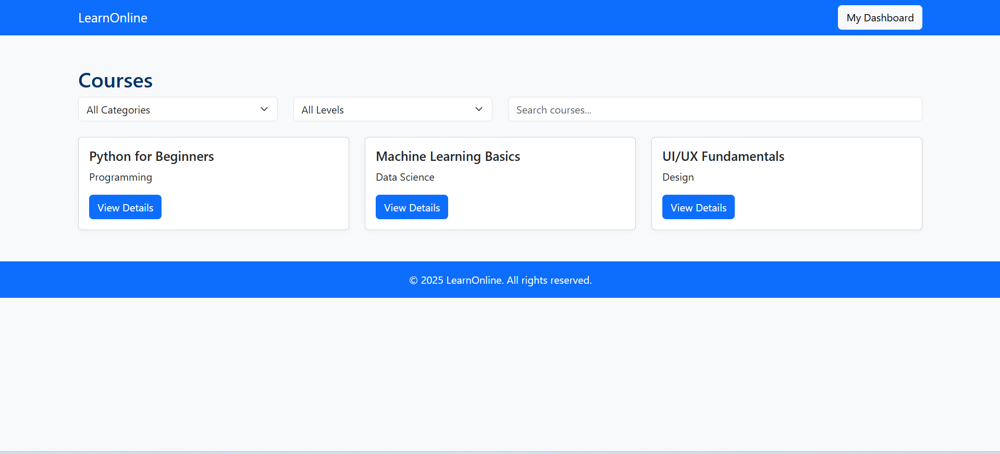

# Project Responsive Web Design using Bootstrap
## Date:17/11/2025

## AIM:
To create a simplified clone of Dribbble (https://dribbble.com/) landing page.


## DESIGN STEPS:

### Step 1:
Clone the repository from GitHub.

### Step 2:
Create Django Admin project.

### Step 3:
Create a New App under the Django Admin project.

### Step 4:
Insert the necessary CSS and JavaScript files as external in order to use Bootstrap.

### Step 5:
Create a HTML file and include the needed Bootstrap components.

### Step 6:
Publish the website in the LocalHost.

## PROGRAM :
course-detail
```
<!DOCTYPE html>
<html lang="en">
<head>
  <meta charset="UTF-8">
  <title>Course Detail | LearnOnline</title>
  <link href="https://cdn.jsdelivr.net/npm/bootstrap@5.3.3/dist/css/bootstrap.min.css" rel="stylesheet">
  <link href="css/styles.css" rel="stylesheet">
</head>
<body>
  <nav class="navbar navbar-expand-lg navbar-dark bg-primary">
    <div class="container">
      <a class="navbar-brand" href="index.html">LearnOnline</a>
      <div>
        <a class="btn btn-light" href="dashboard.html">My Dashboard</a>
      </div>
    </div>
  </nav>
  <div class="container my-5">
    <div class="row">
      <div class="col-md-8">
        <h2>Python for Beginners</h2>
        <!-- Course Video Section -->
        <div class="ratio ratio-16x9 mb-3">
          <iframe src="https://www.youtube.com/embed/rfscVS0vtbw" title="Course Video" allowfullscreen></iframe>
        </div>
        <h4>Course Modules</h4>
        <ul class="list-group">
          <li class="list-group-item">Introduction to Python</li>
          <li class="list-group-item">Variables and Data Types</li>
          <li class="list-group-item">Control Structures</li>
          <li class="list-group-item">Functions</li>
          <li class="list-group-item">Projects & Practice</li>
        </ul>
      </div>
      <div class="col-md-4">
        <div class="card p-3 mb-3">
          <h5>About this course</h5>
          <p>Learn Python from scratch. Perfect for beginners!</p>
          <a href="quiz.html" class="btn btn-success">Take Quiz</a>
        </div>
      </div>
    </div>
  </div>
  <footer class="bg-primary text-light text-center py-3">
    &copy; 2025 LearnOnline. All rights reserved.
  </footer>
</body>
</html>
```
courses
<!DOCTYPE html>
<html lang="en">
<head>
  <meta charset="UTF-8">
  <title>Courses | LearnOnline</title>
  <link href="https://cdn.jsdelivr.net/npm/bootstrap@5.3.3/dist/css/bootstrap.min.css" rel="stylesheet">
  <link href="css/styles.css" rel="stylesheet">
</head>
<body>
  <nav class="navbar navbar-expand-lg navbar-dark bg-primary">
    <div class="container">
      <a class="navbar-brand" href="index.html">LearnOnline</a>
      <div>
        <a class="btn btn-light" href="dashboard.html">My Dashboard</a>
      </div>
    </div>
  </nav>
  <div class="container my-5">
    <h2>Courses</h2>
    <div class="row mb-4">
      <div class="col-md-3">
        <select class="form-select">
          <option selected>All Categories</option>
          <option>Programming</option>
          <option>Data Science</option>
          <option>Design</option>
        </select>
      </div>
      <div class="col-md-3">
        <select class="form-select">
          <option selected>All Levels</option>
          <option>Beginner</option>
          <option>Intermediate</option>
          <option>Advanced</option>
        </select>
      </div>
      <div class="col-md-6">
        <input type="text" class="form-control" placeholder="Search courses...">
      </div>
    </div>
    <div class="row g-4">
      <div class="col-md-4">
        <div class="card h-100">
          <div class="card-body">
            <h5 class="card-title">Python for Beginners</h5>
            <p class="card-text">Programming</p>
            <a href="course-detail.html" class="btn btn-primary">View Details</a>
          </div>
        </div>
      </div>
      <div class="col-md-4">
        <div class="card h-100">
          <div class="card-body">
            <h5 class="card-title">Machine Learning Basics</h5>
            <p class="card-text">Data Science</p>
            <a href="course-detail.html" class="btn btn-primary">View Details</a>
          </div>
        </div>
      </div>
      <div class="col-md-4">
        <div class="card h-100">
          <div class="card-body">
            <h5 class="card-title">UI/UX Fundamentals</h5>
            <p class="card-text">Design</p>
            <a href="course-detail.html" class="btn btn-primary">View Details</a>
          </div>
        </div>
      </div>
    </div>
  </div>
  <footer class="bg-primary text-light text-center py-3">
    &copy; 2025 LearnOnline. All rights reserved.
  </footer>
</body>
</html>
```
quiz
```
<!DOCTYPE html>
<html lang="en">
<head>
  <meta charset="UTF-8">
  <title>Quiz | LearnOnline</title>
  <link href="https://cdn.jsdelivr.net/npm/bootstrap@5.3.3/dist/css/bootstrap.min.css" rel="stylesheet">
  <link href="css/styles.css" rel="stylesheet">
  <style>
    .option-selected {
      background: #e7f3ff;
    }
    .disabled {
      pointer-events: none;
      opacity: 0.6;
    }
  </style>
</head>
<body>
  <nav class="navbar navbar-expand-lg navbar-dark bg-primary">
    <div class="container">
      <a class="navbar-brand" href="index.html">LearnOnline</a>
      <div>
        <a class="btn btn-light" href="dashboard.html">My Dashboard</a>
      </div>
    </div>
  </nav>
  <div class="container my-5">
    <div class="row mb-4">
      <div class="col">
        <h2>Quiz: Python Basics</h2>
      </div>
      <div class="col text-end">
        <span class="badge bg-secondary p-2 fs-5" id="timer">Time: 10:00</span>
        <span class="badge bg-info p-2 fs-5" id="score">Score: 0</span>
      </div>
    </div>
    <div id="quiz-area"></div>
    <div id="result-area" class="mt-4"></div>
  </div>
  <footer class="bg-primary text-light text-center py-3">
    &copy; 2025 LearnOnline. All rights reserved.
  </footer>
  <script>
    // Sample Quiz Data
    const questions = [
      {
        q: "What is the correct way to declare a variable in Python?",
        options: [
          "var x = 10",
          "x = 10",
          "int x = 10"
        ],
        answer: 1
      },
      {
        q: "Which of these is a valid function definition in Python?",
        options: [
          "function myFunc():",
          "def myFunc():",
          "func myFunc()"
        ],
        answer: 1
      },
      {
        q: "What does 'print(\"Hello\")' output?",
        options: [
          "Hello",
          "print(\"Hello\")",
          "Nothing"
        ],
        answer: 0
      }
    ];

    let current = 0;
    let selected = Array(questions.length).fill(null);
    let score = 0;
    let quizSubmitted = false;

    // Timer
    let totalSeconds = 600;
    let timerInterval = setInterval(function() {
      if (totalSeconds <= 0) {
        clearInterval(timerInterval);
        submitQuiz();
        document.getElementById('timer').innerText = "Time: 00:00";
        return;
      }
      totalSeconds--;
      let min = String(Math.floor(totalSeconds / 60)).padStart(2, '0');
      let sec = String(totalSeconds % 60).padStart(2, '0');
      document.getElementById('timer').innerText = `Time: ${min}:${sec}`;
    }, 1000);

    function renderQuiz() {
      let q = questions[current];
      let area = document.getElementById('quiz-area');
      let disabled = quizSubmitted ? "disabled" : "";
      let html = `
        <div class="card p-4 mb-3 ${disabled}">
          <h5>Question ${current + 1} of ${questions.length}</h5>
          <p>${q.q}</p>
          <div>`;
      q.options.forEach((opt, i) => {
        html += `
        <div class="form-check mb-2">
          <input class="form-check-input" type="radio" name="q${current}" id="q${current}a${i}" ${selected[current] === i ? "checked" : ""} onchange="selectOption(${i})" ${disabled}>
          <label class="form-check-label" for="q${current}a${i}">${opt}</label>
        </div>`;
      });
      html += `</div>
      <div class="mt-4 d-flex justify-content-between">`;
      html += `<button class="btn btn-light" onclick="prevQ()" ${current === 0 ? "disabled" : ""} ${disabled}>Previous</button>`;
      if(current < questions.length - 1) {
        html += `<button class="btn btn-primary" onclick="nextQ()" ${disabled} ${selected[current] === null ? "disabled" : ""}>Next</button>`;
      } else {
        html += `<button class="btn btn-success" onclick="submitQuiz()" id="submitBtn" ${disabled} ${selected[current] === null ? "disabled" : ""}>Submit Quiz</button>`;
      }
      html += `</div></div>`;
      area.innerHTML = html;
      updateScore();
    }

    window.selectOption = function(i) {
      if(quizSubmitted) return;
      selected[current] = i;
      renderQuiz();
    };

    window.nextQ = function() {
      if(current < questions.length - 1) {
        current++;
        renderQuiz();
      }
    };

    window.prevQ = function() {
      if(current > 0) {
        current--;
        renderQuiz();
      }
    };

    function updateScore() {
      let sc = 0;
      for(let i=0; i<questions.length; i++) {
        if(selected[i] === questions[i].answer) sc++;
      }
      document.getElementById('score').innerText = `Score: ${sc}`;
    }

    window.submitQuiz = submitQuiz;
    function submitQuiz() {
      if(quizSubmitted) return;
      quizSubmitted = true;
      clearInterval(timerInterval);
      let sc = 0;
      for(let i=0; i<questions.length; i++) {
        if(selected[i] === questions[i].answer) sc++;
      }
      document.getElementById('score').innerText = `Score: ${sc}`;
      document.getElementById('quiz-area').classList.add('disabled');
      let res = `<div class="alert alert-info"><strong>Quiz Submitted!</strong> Your score is ${sc} out of ${questions.length}.</div>`;
      document.getElementById('result-area').innerHTML = res;
      renderQuiz();
    }

    // Initial render
    renderQuiz();
  </script>
</body>
</html>
```
dashboard
```
<!DOCTYPE html>
<html lang="en">
<head>
  <meta charset="UTF-8">
  <title>User Dashboard | LearnOnline</title>
  <link href="https://cdn.jsdelivr.net/npm/bootstrap@5.3.3/dist/css/bootstrap.min.css" rel="stylesheet">
</head>
<body>

  <!-- NAVBAR -->
  <nav class="navbar navbar-expand-lg navbar-dark bg-primary">
    <div class="container">
      <a class="navbar-brand fw-bold" href="index.html">LearnOnline</a>

      <button class="navbar-toggler" type="button" data-bs-toggle="collapse" data-bs-target="#navbarMenu">
        <span class="navbar-toggler-icon"></span>
      </button>

      <div class="collapse navbar-collapse" id="navbarMenu">
        <ul class="navbar-nav ms-auto">
          <li class="nav-item">
            <a class="btn btn-light me-2" href="courses.html">Browse Courses</a>
          </li>
          <li class="nav-item">
            <a class="btn btn-outline-light" data-bs-toggle="modal" data-bs-target="#notificationModal">
              Notifications <span class="badge bg-danger">3</span>
            </a>
          </li>
        </ul>
      </div>
    </div>
  </nav>

  <!-- BREADCRUMB -->
  <nav aria-label="breadcrumb" class="bg-light py-2">
    <div class="container">
      <ol class="breadcrumb mb-0">
        <li class="breadcrumb-item"><a href="index.html">Home</a></li>
        <li class="breadcrumb-item active" aria-current="page">Dashboard</li>
      </ol>
    </div>
  </nav>

  <div class="container my-5">

    <!-- ALERT -->
    <div class="alert alert-success alert-dismissible fade show" role="alert">
      Welcome back! New courses have been recommended for you.
      <button type="button" class="btn-close" data-bs-dismiss="alert"></button>
    </div>

    <!-- USER PROFILE CARD -->
    <div class="card mb-4 shadow-sm">
      <div class="card-body d-flex align-items-center">
        
        <div>
          <h4 class="mb-0">John Doe</h4>
          <span class="badge bg-primary">Premium Member</span>
        </div>
      </div>
    </div>

    <h2 class="mb-4">My Courses</h2>

    <!-- COURSE GRID -->
    <div class="row g-4">
      <!-- Course 1 -->
      <div class="col-md-4">
        <div class="card h-100 shadow-sm">
          <div class="card-body">
            <h5 class="card-title">Python for Beginners</h5>
            <p class="text-muted">In Progress</p>

            <!-- Progress bar -->
            <div class="progress mb-3">
              <div class="progress-bar" style="width: 60%;">60%</div>
            </div>

            <a href="course-detail.html" class="btn btn-primary w-100">Go to Course</a>
          </div>
        </div>
      </div>

      <!-- Course 2 -->
      <div class="col-md-4">
        <div class="card h-100 shadow-sm">
          <div class="card-body">
            <h5 class="card-title">UI/UX Fundamentals</h5>
            <p class="text-muted">Not Started</p>

            <div class="progress mb-3">
              <div class="progress-bar bg-secondary" style="width: 0%;">0%</div>
            </div>

            <a href="course-detail.html" class="btn btn-primary w-100">Start Course</a>
          </div>
        </div>
      </div>

      <!-- Course 3 -->
      <div class="col-md-4">
        <div class="card h-100 shadow-sm">
          <div class="card-body">
            <h5 class="card-title">Web Development Basics</h5>
            <p class="text-muted">Completed</p>

            <div class="progress mb-3">
              <div class="progress-bar bg-success" style="width: 100%;">100%</div>
            </div>

            <a href="#" class="btn btn-outline-success w-100">View Certificate</a>
          </div>
        </div>
      </div>

    </div>
  </div>

  <!-- FOOTER -->
  <footer class="bg-primary text-light text-center py-3">
    &copy; 2025 LearnOnline. All rights reserved.
  </footer>

  <!-- NOTIFICATION MODAL -->
  <div class="modal fade" id="notificationModal" tabindex="-1">
    <div class="modal-dialog">
      <div class="modal-content">
        
        <div class="modal-header">
          <h5 class="modal-title">Notifications</h5>
          <button type="button" class="btn-close" data-bs-dismiss="modal"></button>
        </div>

        <div class="modal-body">
          <ul class="list-group">
            <li class="list-group-item">New course recommendations available.</li>
            <li class="list-group-item">UI/UX quiz result updated.</li>
            <li class="list-group-item">Python course progress: 60% completed.</li>
          </ul>
        </div>

        <div class="modal-footer">
          <button type="button" class="btn btn-primary" data-bs-dismiss="modal">Close</button>
        </div>

      </div>
    </div>
  </div>

<script src="https://cdn.jsdelivr.net/npm/bootstrap@5.3.3/dist/js/bootstrap.bundle.min.js"></script>
</body>
</html>

```
index
<!DOCTYPE html>
<html lang="en">
<head>
  <meta charset="UTF-8">
  <title>Online Learning Platform | Home</title>
  <link href="https://cdn.jsdelivr.net/npm/bootstrap@5.3.3/dist/css/bootstrap.min.css" rel="stylesheet">
  <link href="css/styles.css" rel="stylesheet">
</head>
<body>
  <nav class="navbar navbar-expand-lg navbar-dark bg-primary">
    <div class="container">
      <a class="navbar-brand" href="#">LearnOnline</a>
      <div>
        <a class="btn btn-light" href="dashboard.html">My Dashboard</a>
      </div>
    </div>
  </nav>
  <header class="bg-light py-5 text-center">
    <div class="container">
      <h1 class="display-4">Boost Your Skills Online</h1>
      <p class="lead">Join thousands of learners and upskill with our expert-led courses.</p>
      <a href="courses.html" class="btn btn-primary btn-lg mt-3">Browse Courses</a>
    </div>
  </header>
  <section class="container my-5">
    <h2 class="mb-4">Course Categories</h2>
    <div class="row g-4">
      <div class="col-md-4">
        <div class="card h-100 text-center">
          <div class="card-body">
            <h5 class="card-title">Programming</h5>
            <p class="card-text">Learn Python, JavaScript, and more</p>
          </div>
        </div>
      </div>
      <div class="col-md-4">
        <div class="card h-100 text-center">
          <div class="card-body">
            <h5 class="card-title">Data Science</h5>
            <p class="card-text">Data Analysis, Machine Learning</p>
          </div>
        </div>
      </div>
      <div class="col-md-4">
        <div class="card h-100 text-center">
          <div class="card-body">
            <h5 class="card-title">Design</h5>
            <p class="card-text">UI/UX, Graphic Design, Figma</p>
          </div>
        </div>
      </div>
    </div>
  </section>
  <footer class="bg-primary text-light text-center py-3">
    &copy; 2025 LearnOnline. All rights reserved.
  </footer>
</body>
</html>
```

## OUTPUT:




## RESULT:
The Project for responsive web design using Bootstrap is completed successfully.
